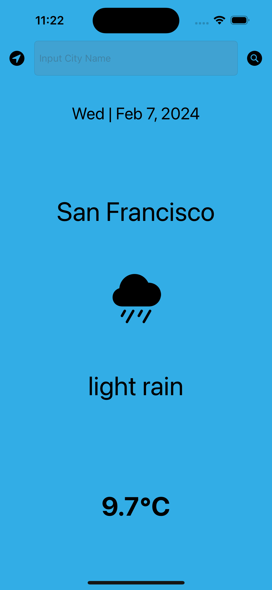
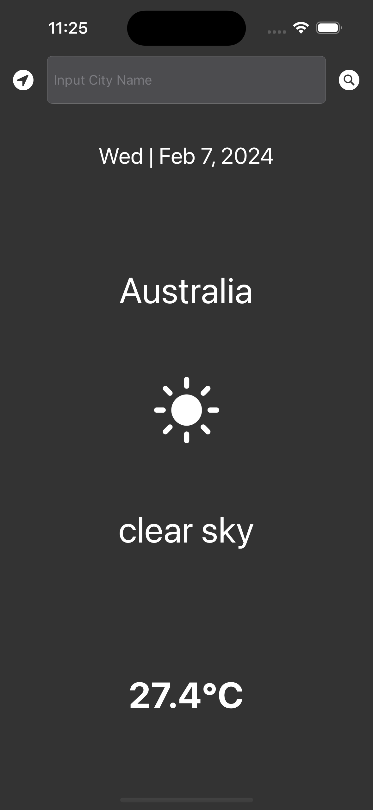

#  SimplyWeather

## My Goal

To take my iOS app development to the next level. I'm going to use here what we call a tool in creating apps called Application Programming Interface (API) to grab live data from the internet.

By the end of this, I will have made a simple, dark-mode enabled weather app. You'll be able to check the weather for the current location using this app based on the GPS data from the iPhone as well as by searching for a city name using a searchbar.

## Things I learned

* Create a dark-mode enabled app.
* Use the UITextField to get user input. 
* Implement the delegate pattern.
* Use Swift protocols and extensions. 
* Use Swift guard keyword. 
* Use Swift computed properties.
* Use Swift closures and completion handlers.
* Use URLSession to network and make HTTP requests.
* Parse JSON with the native Encodable and Decodable protocols. 
* Use Grand Central Dispatch to fetch the main thread.
* Use Core Location to get the current location from the phone GPS. 

## Screenshots

## Plans for next version

* Add light/dark theme toggle
* Add temperature celcius/farenheit toggle
* Add 5 day forecast
* Add saving data for offline